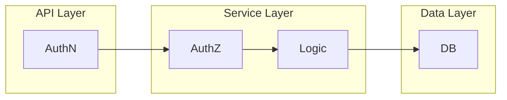

# 3. Integration Guide - Practical Integration

The third part the integration guide covers practical integration of the **PyPermission** library into the Python backend code of the fictional MeetDown application.

!!! info
    The complete fictional MeetDown application is included in the **PyPermission** package. The corresponding Python code can be found in the library repository in the folder [`src/pypermission/example`](https://gitlab.com/DigonIO/pypermission/-/tree/main/src/pypermission/example).

## Project Architecture

At the beginning, the project architecture is explained, how the fictional backend project is structured. As usual, it is divided into the three layers: `API Layer`, `Service Layer`, and `Data Layer`.



As shown in the diagram, **authentication (AuthN)** should be implemented in the `API Layer`. The `API Layer` itself may be a REST API build with `FastAPI`, or a message-bus system with its own AuthN protocol. Because the guide focuses solely on **authorization (AuthZ)**, the `API Layer` is not discussed further.

It is even advantageous to separate AuthN (in the `API Layer`) and AuthZ(in the `Service Layer`), as this makes it easy to replace or run multiple `API Layer` technologies in parallel. For this reason, AuthZ is grouped together with the Business Logic in the `Service Layer`.

The guide also covers the `Data Layer`, which for simplicity uses `SQLAlchemy`. In practice, the Business Logic does not need to use the same database technology as **PyPermission**.

### Files & Folders

The required Python files are structured as shown below and are included in the **PyPermission** [repository](https://gitlab.com/DigonIO/pypermission/-/tree/main/src/pypermission/example). The files for the `Service Layer` are located in the `service` directory, and those for the `Data Layer` in the `model` directory. In both cases, the files are organized by feature.

A fictional **MeetDownApp** class is created in `app.py`, which primarily serves to assemble the entire backend. The `types.py` file contains only utility classes.

```bash
$ tree src/pypermission/example --gitignore
src/pypermission/example
├── app.py
├── model
│   ├── event.py
│   ├── group.py
│   └── user.py
├── service
│   ├── event.py
│   ├── group.py
│   └── user.py
└── types.py
```

## Static **Roles**

As described in the [second part](./2_rbac_system_design.md) of the guide, there are both static and dynamic **Roles**. Static **Roles** can be created when the application instance is first set up, for example through a database migration script, or as shown in this guide, through a function that populate the application.

The following sections explain all components necessary for understanding this process.

### The Context

Before introducing the **MeetDownApp** class itself, we first describe the **Context** class. The **Context** is required to pass all metadata about the current request into the service functions. In a simple scenario, e.g. when using `FastAPI` in the `API Layer`, this means reading a cookie or bearer token from the incoming request, performing AuthN, and identifying the corresponding `User`. In more complex scenarios, requests coming from multiple `API Layer` technologies, such as a message bus or a REST API, can be unified.

Because the `API Layer` is intentionally ignored in this guide, the potential `user_id` must be manually inserted into the **Context** of the fictional request.

The **Context** typically carries additional meta-information about the request. In this guide, however, only the `user_id` and the database session `db` are included. This represents the minimal setup required for the examples, as the focus of the integration guide is solely on AuthZ.

```python title="src/pypermission/example/types.py"
from uuid import UUID

class Context:
    user_id: UUID | None
    db: Session

    def __init__(self, *, user_id: UUID | None = None, db: Session):
        self.user_id = user_id
        self.db = db
```

### The MeetDownApp

After the **Context**, the **MeetDownApp** class is introduced. For the purposes of this guide, it is kept intentionally simple again, the focus is on explaining AuthZ. Therefore, the only task performed in the `__init__()` method, and thus the sole purpose of instantiating **MeetDownApp**, is to create the required database tables.

!!! note
    This works because the example uses a single shared database. As a result, the `create_rbac_database_table()` function from **PyPermission** creates both the RBAC tables and the tables relevant to the business logic.

```python title="src/pypermission/example/app.py"
from typing import Final

from sqlalchemy.engine.base import Engine

from pypermission import RBAC
from pypermission.db import create_rbac_database_table
from pypermission.example.service.user import UserService
from pypermission.example.service.group import GroupService
from pypermission.example.service.event import EventService
from pypermission.example.types import Context

class MeetDownApp:
    _user: Final = UserService
    _group: Final = GroupService
    _event: Final = EventService

    def __init__(self, *, engine: Engine) -> None:
        create_rbac_database_table(engine=engine)

        # TODO fix populate call
        with replace_me:
            populate(ctx=Context(db=db))


    @property
    def user(self) -> type[UserService]:
        return self._user

    @property
    def group(self) -> type[GroupService]:
        return self._group

    @property
    def event(self) -> type[EventService]:
        return self._event
```

Additionally, the **MeetDownApp** class provides convenient properties that allow quick access to the feature-specific service functions. This is especially helpful when experimenting with the guide in an interactive environment such as a Jupyter notebook.

### The Population

```python title="src/pypermission/example/app.py"

def populate(self, *, ctx: Context) -> None:
    RBAC.role.create(role="guest", db=ctx.db)
    RBAC.role.create(role="user", db=ctx.db)
    RBAC.role.create(role="moderator", db=ctx.db)

    RBAC.role.add_hierarchy(
        parent_role="guest",
        child_role="user",
        db=ctx.db,
    )
    RBAC.role.add_hierarchy(
        parent_role="user",
        child_role="moderator",
        db=ctx.db,
    )

    _populate_guest_role_policies(ctx=ctx)
    _populate_user_role_policies(ctx=ctx)
    _populate_moderator_role_policies(ctx=ctx)
```

```python title="src/pypermission/example/app.py"

def _populate_guest_role_policies(ctx: Context) -> None:
    RBAC.role.grant_permission(
        role="guest",
        permission=Permission(
            resource_type="group",
            resource_id="*",
            action="access",
        ),
        db=ctx.db,
    )
    RBAC.role.grant_permission(
        role="guest",
        permission=Permission(
            resource_type="event",
            resource_id="*",
            action="access",
        ),
        db=ctx.db,
    )
```

## Dynamic **Roles**

WIP
