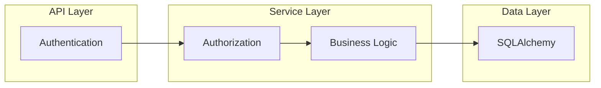

# 3. Integration Guide - Practical Integration

The third part the integration guide covers practical integration of the **PyPermission** library into the Python backend code of the fictional MeetDown application.

!!! info

    The complete fictional MeetDown application is included in the **PyPermission** package. The corresponding Python code can be found in the library repository in the folder [`src/pypermission/example`](https://gitlab.com/DigonIO/pypermission/-/tree/main/src/pypermission/example).

## Static **Roles**

## Dynamic **Roles**
