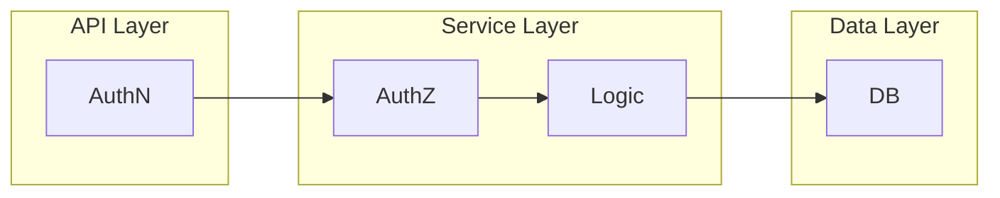

# 3. Integration Guide - Practical Integration

This part of the guide covers how the **PyPermission** library can be integrated into the Python backend code for the fictional MeetDown application.

!!! info
    The complete demo application is included in the **PyPermission** package. The corresponding Python code can be found in the library repository within the folder [`src/pypermission/example`](https://gitlab.com/DigonIO/pypermission/-/tree/main/src/pypermission/example).

## Project Architecture

The project architecture is introduced first, outlining the structure of the fictional backend. As standard, it is organized into three distinct layers: `API Layer`, `Service Layer`, and `Data Layer`.



As shown in the diagram, **authentication (AuthN)** is implemented within the `API Layer`. This layer may consist of a REST API built with `FastAPI` or a message-bus system using its own AuthN protocol. Since the guide focuses exclusively on **authorization (AuthZ)**, the `API Layer` is not further elaborated.

Separating Authentication (AuthN) in the `API Layer` from Authorization (AuthZ) in the `Service Layer` is beneficial, as it allows for easy replacement or parallel operation of multiple `API Layer` technologies. For this reason, AuthZ is co-located with the Business Logic within the `Service Layer`.

The guide also covers the `Data Layer`, which for simplicity uses `SQLAlchemy`. In practice, the Business Logic may use a different database technology than **PyPermission**.

### Files & Folders

The required Python files are arranged as shown below and are part of the **PyPermission** [repository](https://gitlab.com/DigonIO/pypermission/-/tree/main/src/pypermission/example). The `Service Layer` components are located in the `service` directory, while the `Data Layer` components reside in the `model` directory. In both cases, files are grouped by feature.

A fictional **MeetDownApp** class is defined in `app.py` to assemble the entire backend. The `types.py` file contains utility classes only.

```bash
$ tree src/pypermission/example --gitignore
src/pypermission/example
├── app.py
├── model
│   ├── event.py
│   ├── group.py
│   └── user.py
├── service
│   ├── event.py
│   ├── group.py
│   └── user.py
└── types.py
```

## Static **Roles**

As explained in the [second part](./2_rbac_system_design.md) of the guide, **Roles** are either static or dynamic. Static **Roles** are established at application startup - either via a database migration or, as shown here, through an initialization function that populates the system.

The following sections describe the components required to understand this setup.

### The Context

Before introducing the **MeetDownApp** class, we describe the **Context** class. The **Context** encapsulates all metadata relevant to the current request and is passed to service functions. In a simple setup - such as using `FastAPI` in the `API Layer` - this involves reading a cookie or bearer token, performing AuthN, and identifying the associated `User`. In more complex scenarios involving multiple `API Layer` technologies (e.g., message buses or REST APIs), the **Context** can unify request metadata across different entry points.

As the `API Layer` is omitted in this guide, the `user_id` must be manually added to the **Context** of the fictional request.

The **Context** typically contains metadata associated with the request. For the examples in this guide, only the `user_id` and the database session `db` are included - a minimal setup sufficient for demonstrating AuthZ, as the guide focuses exclusively on authorization.

```python title="src/pypermission/example/types.py"
from uuid import UUID

class Context:
    user_id: UUID | None
    db: Session

    def __init__(self, *, user_id: UUID | None = None, db: Session):
        self.user_id = user_id
        self.db = db
```

### The MeetDownApp

After the **Context**, the **MeetDownApp** class is introduced. For the purposes of this guide, it is kept intentionally simple. The sole task performed in the `__init__()` method, and thus the only reason for instantiating **MeetDownApp**, is to create the required database tables.

!!! note
    This works because the example uses a single shared database. As a result, the `create_rbac_database_table()` function from **PyPermission** creates both the RBAC tables and the business logic tables. This is done for simplicity reasons.

!!! warning
    Using a shared database for RBAC and application data creates the risk of corrupting the RBAC tables. A developer could easily write queries that direcly modify the RBAC tables without respecting constraints enforced by the **PyPermission** API while working on a feature or migration script.

```{.python notest title="src/pypermission/example/app.py"}
from typing import Final

from sqlalchemy.engine.base import Engine

from pypermission import RBAC
from pypermission.db import create_rbac_database_table
from pypermission.example.service.user import UserService
from pypermission.example.service.group import GroupService
from pypermission.example.service.event import EventService
from pypermission.example.types import Context

class MeetDownApp:
    user: Final = UserService
    group: Final = GroupService
    event: Final = EventService

    def __init__(self, *, engine: Engine) -> None:
        create_rbac_database_table(engine=engine)

        # TODO fix populate call
        with replace_me:
            populate(ctx=Context(db=db))
```

The **MeetDownApp** class includes properties that provide direct access to the service functions for each feature, simplifying interaction with the backend. This is particularly useful when testing or exploring the integration in an interactive environment such as a Jupyter notebook.

### The Population

```python title="src/pypermission/example/app.py"
def populate(self, *, ctx: Context) -> None:
    RBAC.role.create(role="guest", db=ctx.db)
    RBAC.role.create(role="user", db=ctx.db)
    RBAC.role.create(role="moderator", db=ctx.db)

    RBAC.role.add_hierarchy(
        parent_role="guest",
        child_role="user",
        db=ctx.db,
    )
    RBAC.role.add_hierarchy(
        parent_role="user",
        child_role="moderator",
        db=ctx.db,
    )

    _populate_guest_role_policies(ctx=ctx)
    _populate_user_role_policies(ctx=ctx)
    _populate_moderator_role_policies(ctx=ctx)
```

```python title="src/pypermission/example/app.py"
def _populate_guest_role_policies(ctx: Context) -> None:
    RBAC.role.grant_permission(
        role="guest",
        permission=Permission(
            resource_type="group",
            resource_id="*",
            action="access",
        ),
        db=ctx.db,
    )
    RBAC.role.grant_permission(
        role="guest",
        permission=Permission(
            resource_type="event",
            resource_id="*",
            action="access",
        ),
        db=ctx.db,
    )
```

## Dynamic **Roles**

WIP
