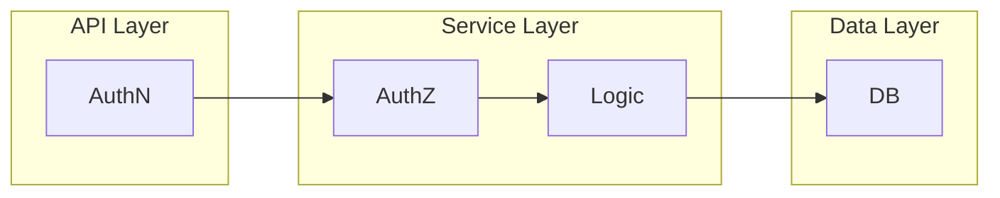

# 3. Integration Guide - Practical Integration

The third part the integration guide covers practical integration of the **PyPermission** library into the Python backend code of the fictional MeetDown application.

!!! info

    The complete fictional MeetDown application is included in the **PyPermission** package. The corresponding Python code can be found in the library repository in the folder [`src/pypermission/example`](https://gitlab.com/DigonIO/pypermission/-/tree/main/src/pypermission/example).

## Project Architecture

Zu Beginn wird die Projekt Architektur erläuter, wie das fiktive Backendprojekt aufgebaut ist. Klassisch wird zwischen den 3 layern `API Layer`, `Service Layer` und `Data Layer`. Die Architektur ist in dem folgenden Diagramm grafisch dargestellt:

At the beginning, the project architecture is explained, how the fictional backend project is structured. As usual, it is divided into the three layers: `API Layer`, `Service Layer`, and `Data Layer`.



As shown in the diagram, **authentication (AuthN)** should be implemented in the `API Layer`. The `API Layer` itself may be a REST API build with FastAPI, or a message-bus system with its own AuthN protocol. Because the integration guide focuses solely on **authorization (AuthZ)**, the `API Layer` is not discussed further.

It is even advantageous to separate AuthN (in the `API Layer`) and AuthZ(in the `Service Layer`), as this makes it easy to replace or run multiple `API Layer` technologies in parallel. For this reason, AuthZ is grouped together with the Business Logic in the `Service Layer`.

The integration guide also covers the `Data Layer`, which for simplicity uses `SQLAlchemy`. In practice, the Business Logic does not need to use the same database technology as **PyPermission**.

### Files & Folders

The required Python files are structured as shown below and are included in the **PyPermission** [repository](https://gitlab.com/DigonIO/pypermission/-/tree/main/src/pypermission/example). The files for the `Service Layer` are located in the `service` directory, and those for the `Data Layer` in the `model` directory. In both cases, the files are organized by feature.

A fictional MeetDownApp class is created in `app.py`, which primarily serves to assemble the entire backend. The `types.py` file contains only utility classes.

```bash
$ tree src/pypermission/example --gitignore
src/pypermission/example
├── app.py
├── model
│   ├── event.py
│   ├── group.py
│   └── user.py
├── service
│   ├── event.py
│   ├── group.py
│   └── user.py
└── types.py
```

## Static **Roles**

## Dynamic **Roles**
