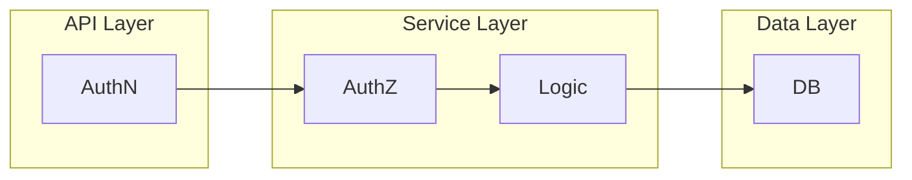

# 3. Integration Guide - RBAC Code Design

This part of the guide covers how the **PyPermission** library can be integrated into the Python backend code for the fictional MeetDown application.

## Recommended Project Architecture

The following outlines the typical structure of a backend - organized into three distinct layers: `API Layer`, `Service Layer`, and `Data Layer`.



As shown in the diagram, **authentication (AuthN)** is implemented within the `API Layer`. This layer may consist of a REST API built with `FastAPI` or a message-bus system using its own AuthN protocol. Since the guide focuses exclusively on **authorization (AuthZ)**, the `API Layer` is not further elaborated.

Separating Authentication (AuthN) in the `API Layer` from Authorization (AuthZ) in the `Service Layer` is beneficial, as it allows for easy replacement or parallel operation of multiple `API Layer` technologies. For this reason, AuthZ is co-located with the Business Logic within the `Service Layer`.

!!! warning
    Using a shared database for RBAC and application data creates the risk of corrupting the RBAC tables. A developer could easily write queries that direcly modify the RBAC tables without respecting constraints enforced by the **PyPermission** API while working on a feature or migration script.

## The `Context` object

The **Context** encapsulates all metadata relevant to the current request and is passed to service functions. In a simple setup - such as using `FastAPI` in the `API Layer` - this involves reading a cookie or bearer token, performing AuthN, and identifying the associated `User`. In more complex scenarios involving multiple `API Layer` technologies (e.g., message buses or REST APIs), the **Context** can unify request metadata across different entry points.

For the examples in this guide, only the `user_orm` and the database session `db` are included - a minimal setup sufficient for demonstrating AuthZ, as the guide focuses exclusively on authorization.

The following code snippet shows the `Context` object:

```python
class Context:
    user_orm: UserORM | None
    db: Session

    def __init__(self, *, user_orm: UserORM | None = None, db: Session):
        self.user_orm = user_orm
        self.db = db
```

Here the `UserORM` shows a minimal setup to represent a `User` in the application database:

```python
from sqlalchemy.orm import DeclarativeBase
from uuid import UUID
from enum import StrEnum

from sqlalchemy.orm import Mapped, mapped_column
from sqlalchemy.sql.sqltypes import Enum as SqlEnum
from sqlalchemy.sql.sqltypes import UUID as SqlUUID
from sqlalchemy.sql.sqltypes import String, Boolean

class MeetDownORM(DeclarativeBase): ...

class State(StrEnum):
    ACTIVE = "active"
    INACTIVE = "inactive"

class UserORM(MeetDownORM):
    __tablename__ = "app_user_table"
    id: Mapped[UUID] = mapped_column(SqlUUID, primary_key=True)
    username: Mapped[str] = mapped_column(String)
    email: Mapped[str] = mapped_column(String)
    is_admin: Mapped[bool] = mapped_column(Boolean)
    state: Mapped[State] = mapped_column(
        SqlEnum(State, name="UserORM.State"), default=State.ACTIVE
    )
```

## Permission Checks

### Getting a `User` object

Required **Permission**: `User[<UUID>]:access` or `User[<*>]:access`, where `User[<*>]:access` acts as a wildcard **Permission** granting access to any `User` resource.

Additional implementation detail: the `rbac` flag controls whether this function performs a **Permission** check itself; when it is set to `False`, the function assumes that authorization has already been handled by the caller and skips the check. Admin `User`s are treated as having all **Permissions** and therefore bypass the check automatically.

```python linenums="1" hl_lines="7-32"
def get(
    *,
    user_id: UUID,
    ctx: Context,
    rbac: bool = True,
) -> UserORM:
    # Permission check (check against the User in the Context).
    match rbac, ctx.user_orm:
        case True, UserORM(is_admin=True):
            ...
            # Pass the Permission check if the Context User is an admin.
        case True, UserORM():
            subject = f"User[{ctx.user_orm.id}]"
            permission = Permission(
                resource_type="User",
                resource_id=str(user_id),
                action="access",
            )

            if not RBAC.subject.check_permission(
                subject=subject,
                permission=permission,
                db=ctx.db,
            ):
                raise ExampleError(
                    f"Permission '{permission}' not granted for Subject '{subject}'!"
                )
        case True, None:
            raise ExampleError("No User in Context!")
        case False, _:
            # Pass the Permission check if the 'rbac' flag is disabled!
            ...

    user_orm = ctx.db.get(UserORM, user_id)
    if user_orm is None:
        raise ExampleError(f"Unknown User with ID '{user_id}'!")

    return user_orm
```

Using structural pattern matching, the **Permission** check is performed in a dedicated block, before any application-specific operations take place. For the explicit RBAC bypass path (`rbac=False`) and **Users** marked as `is_admin` this creates distinct fast-paths, while the regular **Permission** lookup via **RBAC** is performed for all other **Users**. Relying on the `match/case` construct here aids in correctly implementing exhaustive checking without missing edge cases.

### Creating a `User` object

Creating a `User` requires the **Permission** `User:create`. Only `admin`s may create `User`s with the **Role** `moderator` or other `admin`s, and `admin`s bypass this **Permission** check.

```python linenums="1" hl_lines="12-35"
type ApplicationRole = Literal["Guest", "User", "Moderator"]

def create(
    *,
    username: str,
    email: str,
    role: ApplicationRole = "User",
    is_admin: bool = False,
    ctx: Context,
    rbac: bool = True,
) -> UserORM:
    # Permission check (check against the User in the Context).
    match rbac, ctx.user_orm:
        case True, UserORM(is_admin=True):
            # Pass the Permission check if the Context User is an admin.
            ...
        case True, UserORM():
            subject = f"User[{ctx.user_orm.id}]"
            permission = Permission(
                resource_type="User", resource_id="", action="create"
            )
            is_adm_or_mod = is_admin or (role == "Moderator")
            if is_adm_or_mod or not RBAC.subject.check_permission(
                subject=subject,
                permission=permission,
                db=ctx.db,
            ):
                raise ExampleError(
                    f"Permission '{permission}' not granted for Subject '{subject}'!"
                )
        case True, None:
            raise ExampleError("No User in Context!")
        case False, _:
            # Pass the Permission check if the 'rbac' flag is disabled!
            ...

    # Create the application level Resource for the User.
    user_orm = UserORM(username=username, email=email, role=role)
    ctx.db.add(user_orm)
    ctx.db.flush()

    # Create all RBAC level Resources for the User.
    create_role_and_policies(user_orm=user_orm, role=role, ctx=ctx)

    return user_orm
```

In this `create()` function, the `match/case` block centralizes both the regular RBAC check and an additional business constraint that cannot be modeled as a simple **Permission**. Besides handling the fast-paths for `is_admin` and `rbac=False`, the `case True, UserORM()` branch enforces that only `admin`s may create new `moderator`s or additional `admin`s, regardless of the caller’s `User:create` **Permission**. This condition depends on attributes of the target `User` (`role`, `is_admin`) rather than just the requested **Permission**, so it is implemented explicitly in the service logic instead of the RBAC layer. Such hybrid checks (RBAC plus attribute-style conditions) are usually rare; if similar patterns appear frequently, this is a strong indicator that an alternative or complementary authorization model such as ABAC should be considered.

## Creating Application & RBAC objects

### Creating a `User` object

Creating a `User` object triggers the creation of a corresponding RBAC `Role` with the identifier `User[<UserID>]`. This dynamic role enables the user to manage their own account **Resources**, such as editing their profile or deactivating their account, by granting them instance-specific permissions like `User[<UserID>]:edit` and `User[<UserID>]:deactivate`.

```python linenums="1" hl_lines="37-43"
type ApplicationRole = Literal["Guest", "User", "Moderator"]

def create(
    *,
    username: str,
    email: str,
    role: ApplicationRole = "User",
    is_admin: bool = False,
    ctx: Context,
    rbac: bool = True,
) -> UserORM:
    # Permission check (check against the User in the Context).
    match rbac, ctx.user_orm:
        case True, UserORM(is_admin=True):
            # Pass the Permission check if the Context User is an admin.
            ...
        case True, UserORM():
            subject = f"User[{ctx.user_orm.id}]"
            permission = Permission(
                resource_type="User", resource_id="", action="create"
            )
            create_adm_or_mod = is_admin or (role == "Moderator")
            if create_adm_or_mod or not RBAC.subject.check_permission(
                subject=subject,
                permission=permission,
                db=ctx.db,
            ):
                raise ExampleError(
                    f"Permission '{permission}' not granted for Subject '{subject}'!"
                )
        case True, None:
            raise ExampleError("No User in Context!")
        case False, _:
            # Pass the Permission check if the 'rbac' flag is disabled!
            ...

    # Create the application level Resource for the User.
    user_orm = UserORM(username=username, email=email, role=role)
    ctx.db.add(user_orm)
    ctx.db.flush()

    # Create all RBAC level Resources for the User.
    create_role_and_policies(user_orm=user_orm, role=role, ctx=ctx)

    return user_orm
```

After the `User` object is created in the application layer and persisted to the database, the application logic must establish the corresponding RBAC structure to enforce access control. This is done via the `create_role_and_policies` function, which synchronizes the application-level `User` creation with RBAC object creation. Specifically, it creates a dynamic **Role** named `User[<UserID>]` (where `<UserID>` is the UUID of the newly created user), assigns it to the `User` as a **Subject**, and grants it instance-specific **Permissions** (`User[<UserID>]:access`, `User[<UserID>]:edit`, `User[<UserID>]:deactivate`) that allow the user to manage their own profile. The function also assigns the `User`'s static application **Role** (`Guest`, `User`, or `Moderator`) to the **Subject**.

```python
def create_role_and_policies(
    user_orm: UserORM, role: ApplicationRole, ctx: Context
) -> None:
    USER_UUID = f"User[{user_orm.id}]"

    # Create the instance exclusive Subject for the User.
    RBAC.subject.create(subject=USER_UUID, db=ctx.db)

    # Assign the application Role 'Guest' | 'User' | 'Moderator'.
    RBAC.subject.assign_role(subject=USER_UUID, role=role, db=ctx.db)

    # Create and assign the instance exclusive Role for the User.
    RBAC.role.create(role=USER_UUID, db=ctx.db)
    RBAC.subject.assign_role(subject=USER_UUID, role=USER_UUID, db=ctx.db)

    # Grand all instance exclusive Permissions for the User.
    RBAC.role.grant_permission(
        role=USER_UUID,
        permission=Permission(
            resource_type="User", resource_id=str(user_orm.id), action="access"
        ),
        db=ctx.db,
    )
    RBAC.role.grant_permission(
        role=USER_UUID,
        permission=Permission(
            resource_type="User", resource_id=str(user_orm.id), action="edit"
        ),
        db=ctx.db,
    )
    RBAC.role.grant_permission(
        role=USER_UUID,
        permission=Permission(
            resource_type="User", resource_id=str(user_orm.id), action="deactivate"
        ),
        db=ctx.db,
    )
```

### Deleting a `User` object

The RBAC-level objects associated with the `User` are deleted: the dynamic **Role&** named `User[<UserID>]` and the **Subject** with the same identifier. This is necessary because these RBAC resources are tied directly to the specific `User` instance and must be removed when the `User` is deleted to maintain data integrity in the RBAC system. Finally, the application-layer `UserORM` object is deleted from the database.

```python linenums="1" hl_lines="39-46"
def delete(
    *,
    user_id: UUID,
    ctx: Context,
    rbac: bool = True,
) -> UserORM:
    # Permission check (check against the User in the Context).
    match rbac, ctx.user_orm:
        case True, UserORM(is_admin=True, id=admin_id):
            if admin_id == user_id:
                raise ExampleError("An admin can't delete itself!")
            # Pass the Permission check if the Context User is an admin.
        case True, UserORM():
            subject = f"User[{ctx.user_orm.id}]"
            permission = Permission(
                resource_type="User",
                resource_id=str(user_id),
                action="delete",
            )

            if not RBAC.subject.check_permission(
                subject=subject,
                permission=permission,
                db=ctx.db,
            ):
                raise ExampleError(
                    f"Permission '{permission}' not granted for Subject '{subject}'!"
                )
        case True, None:
            raise ExampleError("No User in context!")
        case False, _:
            # Pass the Permission check if the 'rbac' flag is disabled!
            ...

    user_orm = ctx.db.get(UserORM, user_id)
    if user_orm is None:
        raise ExampleError(f"Unknown User with ID '{user_id}'!")

    # Delete all RBAC level Resources for the User.
    USER_UUID = f"User[{user_id}]"
    RBAC.role.delete(role=USER_UUID, db=ctx.db)
    RBAC.subject.delete(subject=USER_UUID, db=ctx.db)

    # Delete the application level Resource for the User.
    ctx.db.delete(user_orm)
    ctx.db.flush()

    return user_orm
```

## Initial RBAC table population

The `populate()` function is intended exclusively for the initial deployment of the application. It creates the predefined **Roles**, establishes the **Role** **Hierarchy**, and assigns the baseline **Permissions**. Once this initial state has been written to the database, later startups should skip this initialization.

```python
def populate(*, ctx: Context) -> None:
    create_roles(ctx=ctx)
    create_hierarchies(ctx=ctx)

    create_guest_role_policies(ctx=ctx)
    create_user_role_policies(ctx=ctx)
    create_moderator_role_policies(ctx=ctx)
```

The corresponding implementation of the called methods can be found in [`example_code.py`](https://gitlab.com/DigonIO/pypermission/-/blob/main/docs/docs/integration_guide/example_code.py).